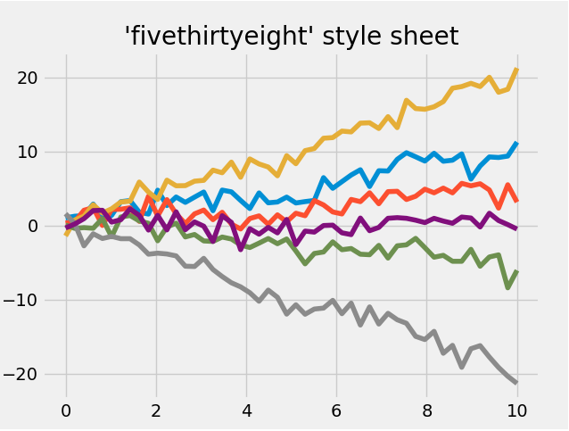
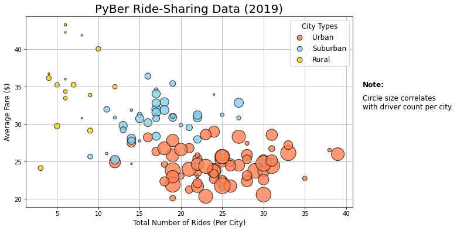

# PyBer Analysis
*Matplotlib Analysis for PyBer Ride-Share company*

## Project Overview 
### Purpose

The purpose of this analysis is to perform exploratory data analysis or EDA for Ride-Share company *PyBer* and to tell compelling story with data visualization. This analysis showcases the relationship between the type of the city (urban, suburban and rural) and the total number of rides, total number of drivers, and the total fares, as well as the average fare per ride and average fare per driver for each city type. This analysis congregate data from January to early May of 2019 and focuses on the following. 

-	The total number of rides for each city type. 
-	The total number of drivers for each city type.
-	The sum of the fares for each city type.
-	The average fare per ride for each city type.
-	The average fare per driver for each city type.
-	The total fares for each week by city type. 

### Background
The data is gathered in two different CSV files (city data and ride data). In this analysis I am using Jupyter notebook and Pandas Library to inspect data, merge datasets, perform calculations an create data series and data frames. In addition to this I am using Python’s plotting library Matplotlib in order to tell visual story and to present complex findings in informative and engaging way. Data Visualization allows audience to absorb information quickly and detect patterns, trends, correlations and outliers in more effective way.

## Resources
- Data Source: 
  - [city_data.csv](Resources/city_data.csv)
  - [ride_data.csv](Resources/ride_data.csv)
- Software: 
  - Jupyter Notebook 6.0.3 
- Environment: 
  - Python 3.7 
- Dependencies:
  - Matplotlib Library 3.2.1 
  - NumPy Library 1.17.0 
  - Pandas Library 1.0.5 

## Results 
From the data frame *The Summary Data Frame per City Type* below we can see the results from each city type – Urban, Suburban and Rural.

     

**1.	The total number of rides for each city type.** 
  -	The total amount of rides is 2.6-times higher in urban cities than in suburban cities.
  -	The total amount of rides is 13-times higher in urban cities than in rural cities.

**2.	The total number of drivers for each city type.**
  -	The total amount of drivers is almost 5-times higher in urban cities than in suburban cities.
  -	The total amount of drivers is almost 31-times higher in urban cities than in rural cities.

**3.	The sum of the fares for each city type.**
  -	The total amount of fares is 2-times higher in urban cities than in suburban cities. 
  -	The total amount of fares is 9-times higher in urban cities than in rural -cities.

**4.	The average fare per ride for each city type.**
  -	The average fare per ride is 1.3-times lower in urban cities than in suburban.
  -	The average fare per ride is 1.4-times lower in urban cities than in rural cities.

**5.	The average fare per driver for each city type.**
  -	The average fare per driver is about 2.4-times lower in urban cities than in suburban cities.
  -	The average fare per driver is about 3.3-times lower in urban cities than in rural cities.

**6.	The total fares for each week by city type.**

  The multi-line graph *Total Fare by City Type* below shows the total fare by city type (urban, suburban and rural) per week from January 2019 to the end of April 2019. 

     

  -	Urban cities have the highest total fares overall. The amount is ranging from the lowest about $1,600 per week to the highest about $2,500 per week. 
  -	Rural cities have the lowest total fares overall. The amount is ranging from the lowest about 250$ per week to the highest about $500 per week.
  -	Suburban cities fall in between urban and rural cities with the total fares. The amount is ranging from the lowest about $650 per week to the highest $1,450 per week.
  -	All cities have pretty steady flow of total fares from week to week with a spike in the third week in February.

### Overview the methods and code

#### Matplotlib
Matplotlib is a Python graphing library and offers wider range of graphs, from line plots to 3D plots and it is widely used amongst data analysts. It also has rich styling options and customizable annotations. Matplotlib has two graphing methods: Pandas ***MATLAB*** and ***The object-oriented method***. MATLAB plotting is used for quick and simple plots that require little coding while the object-oriented method is used for more complex graphs, including those with multiple plots on the same graph and require more coding (1). 

Besides [official Matplotlib documentation]( https://matplotlib.org/3.2.2/users/index.html) Matplotlib offers many default plot settings that have  integrated many features and require little coding to make sophisticated graphs. For example, *Stylesheets* which includes a number of new default stylesheets, as well as the ability to create and package your own styles. One of them is **FiveThiryEight style** and it is typified by bold colors, thick lines, and transparent axes (2). Those styles can save us lots of time and coding.

  

  
FiveThirtyEight StyleSheet form Matplotlib default plots.

#### Exploratory data analysis or EDA
EDA is an important step in data analytics. This critical step can save roughly 15–50% of time on a project because provides a targeted plan for how to clean, sort, and create smaller datasets (3). We could describe EDA also as in “A first look at the data” and it is used to understand and summarize the content of the dataset (4), for example initial look at the columns, datatypes. Additionally, EDA helps answer questions such as, what is the process in determining relationships between variables in the data? What type of data do you have to work with? Are there any outliers or patterns in the data (3)? It is a good practice to check data in graphical and non-graphical way. For example, box and whiskers graph below quickly determine outlier(s). Then we can decide, how to treat those data (drop it or include it). Inspecting Data quality (missing values, possible duplicates, outliers and other anomalies) it is an important step and can have big impact on the data analysis and the story we want to tell.

  

  
Determine an outlier(s) with box and whiskers plot.

## Summary 
One of the first things we can see from the result above is the disproportional distribution rides and drivers amongst the city type. Urban cities have much higher number of rides and drivers; however, the average fare per ride and per driver are lower than in suburban and rural cities. From the chart below we can see another visualization to help us better understand the data. Scatter chart shows include data per each city within city type and reads average fare to total numbers of rides per city. The size of the bubbles correlates with driver count per city.

  

  
Ride-Sharing data in correlation to average fare to total number of rides and drivers per city type.

1. Rural cities have the lowest amount of the rides and drivers, yet the ratio ride to driver is the highest (1.6 compare to 0.67 in urban cities). This indicates that are fewer drivers in rural cities per ride than in the urban cities. Increasing number of drivers could have positive affect on total amount of fares, yet some additional questions need to be answered before making final suggestions. 
•	Is PyBer profitable in rural cities compare to the Suburban and Urban cities? 
•	What is the ride count per capita compare to other types of the cities? 
•	What is the average length of the ride (high amount of the average fare can be affected by lengthy rides that results in higher average fare per ride)?
•	How effective is public transportation in certain rural cities? Some cities might require more PyBer services than others, because of less effective public transportation.

2. There is a matching peak in third week in February for each city type. Based on this information I would suggest to research this peak in more detail that can help determine what cause the jump, therefore could use it as a business strategy in the future. For example, was the total amount of fares increased because of certain event? If so, we could use future events to help PyBer promoting their service.

3. Urban cities have the highest ride and driver count and the lowest average fare per driver, that is $16.57. I would suggest to deeper research this area by finding out what is the employee satisfaction rate and if the company makes profit on this numbers (total fare amount is $39,854.38). If employee rate is high and PyBer is profitable, that would indicate to keep the pattern in addition to take a closer look into the peaks. Finding out what causing them could reveal important information for business planning. 

## References
(1) Module 5. The Matplotlib Library https://courses.bootcampspot.com/courses/200/pages/5-dot-1-2-the-matplotlib-library?module_item_id=59638, Trilogy Education Services,        2000, Web 13 Aug 2020.

(2) Customizing Matplotlib: Configurations and Stylesheets, Python Data Science Hand Book, https://jakevdp.github.io/PythonDataScienceHandbook/04.11-settings-and-stylesheets.html, Web 13 Aug 2020.

(3) Module 5. Plot a Pandas DataFrame and Series https://courses.bootcampspot.com/courses/200/pages/5-dot-1-10-plot-a-pandas-dataframe-and-series?module_item_id=59661, Trilogy Education Services, 2000, Web 13 Aug 2020.

(4)	(4)	Kaushik Mani, Introduction to Exploratory Data Analysis,  https://medium.com/datadriveninvestor/introduction-to-exploratory-data-analysis-682eb64063ff, Web 29 Jan 2019.

## Other Useful Articles
- [Matplotlib users guide]( https://matplotlib.org/3.2.2/users/index.html)
- [Create your Matplotlib style sheet in 10 minutes](https://hfstevance.com/blog/2019/7/22/matplotlib-style)
- [How to generate FTE Graphs in Python]( https://www.dataquest.io/blog/making-538-plots/)
- [Error Bars]( https://problemsolvingwithpython.com/06-Plotting-with-Matplotlib/06.07-Error-Bars/)

